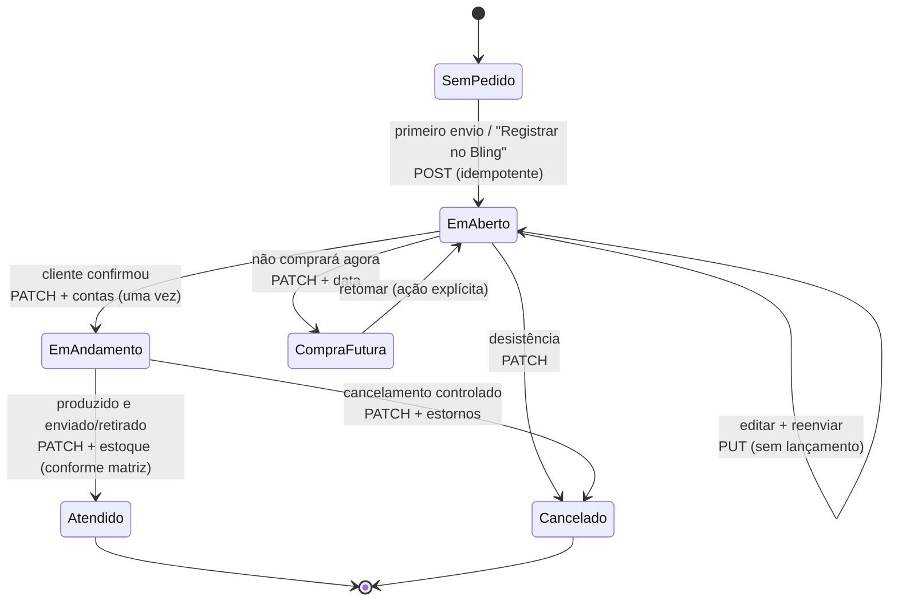

# Plano — Orçamentos do CRM × Pedidos de venda do Bling

**Escrito em:** 14/09/2026
**Fonte funcional:** `ESPECIFICACAO_CRM_ORCAMENTOS_INTEGRACAO_BLING.md` (14/09/2026, fora do repositório)

> **Estado em 16/09/2026: as oito fases estão escritas, as migrações até a 089
> aplicadas e conferidas no banco de teste — e nada foi exercitado contra o
> Bling de verdade**, porque o aplicativo ainda não foi cadastrado (§4). Por
> instrução do Gabriel ("termina todas as fases e segue o recomendado e depois
> eu reviso"), D1–D5 e D9–D12 seguiram a recomendação; as escolhas que a
> recomendação deixava abertas estão em §11. O roteiro de operação é
> [operacao-bling.md](./operacao-bling.md).
>
> | Fase | Commit | Migração |
> |---|---|---|
> | 0 | vários (14/09) | 078, 079 |
> | 1 conexão | `cbfab56` | 082 |
> | 2 cadastros e produtos | `7137e55`, `6d58b9c` | 083, 084 |
> | 3 pedido completo no CRM | `0742747` | 085 |
> | 4 criar, atualizar, enviar | `b111681` | 086, 087 |
> | 5 situação, contas, estoque | `5d02926` | 088 |
> | 6 webhooks e reconciliação | `c83eaf8` | 089 |
> | 7 implantação gradual | este documento, `operacao-bling.md` | — |

**Estado (histórico):** Fase 0 implementada e conferida em 14/09 (F0.1 a F0.8).
- A 078 foi aplicada em 14/09 e exercitada na tela: os dois campos novos
  aparecem, a gaveta grava por uma única chamada à `save_deal_order`, um item
  inválido desfaz a oportunidade inteira (na edição e na criação), e o
  orçamento gerado guarda outras despesas, desconto e valor do desconto.
- A **079** foi aplicada em 14/09: a 078 revogou a função de PUBLIC, o que no
  Supabase não a tira de `anon` (medido). Conferido depois: só com a anon key
  a chamada dá 42501; com a sessão de um usuário, a função continua
  executando.

**Fase 1 (conexão) escrita em 14/09; a 082 foi aplicada em 15/09 e conferida
no banco.**
- **Balde de fichas:** seis pedidos simultâneos liberam dois e mandam esperar
  os outros; o teto do dia devolve -1 e zera na virada.
- **Vez de renovar:** cinco pedidos simultâneos dão um dono e quatro negados,
  com trava de 30 s e teto de um por minuto.
- **Tabelas:** o navegador logado lê vazio e não grava.
- **Colunas:** todas as que o código lê e grava existem.

Falta o que é do Gabriel (§4): cadastrar o aplicativo no Bling, as três
variáveis e a conta de homologação (D9). Sem isso a conexão nunca foi feita
contra o Bling de verdade. Nenhuma decisão de §3 foi respondida — a Fase 1
não dependia delas.

Endurecimento feito no caminho (fora das fases): a 080 e a 081 tiraram de
`anon` dezessete funções que ele executava sem ninguém ter decidido isso;
quatro delas gravavam em qualquer conta com a anon key e um id. A 081 também
deixou por escrito que `is_account_member` continua aberta. As duas foram
aplicadas e conferidas.
- **Com a anon key e com o navegador logado:** as funções fechadas dão
  `permission denied`.
- **Service role:** executa as que são dela.
- **`touch_presence` e `is_account_member`:** seguem abertas.

> **Dados pessoais.** A especificação traz prints com nome, CPF, telefone e
> endereço de clientes reais, e pede que nada disso vá para fixtures, seeds,
> testes ou documentação versionada. Este arquivo não reproduz nenhum desses
> dados, e nenhum teste da integração pode usá-los. Onde a especificação cita
> um pedido real, aqui ele aparece só como "o pedido de exemplo".

---

## 0. Resumo

**A especificação é viável, e o CRM já tem boa parte da estrutura do pedido.**
As migrações 070–076 moldaram a oportunidade no formato do pedido de venda do
Bling. Hoje ela já tem:

- itens com SKU e unidade congelados;
- parcelas;
- frete, transportadora, volumes, peso bruto e condição de pagamento;
- número do pedido;
- um documento PDF/PNG gerado no servidor e arquivado sem possibilidade de
  alteração, com deduplicação.

O item 57 do pacote de correções registrou isso como "atendido pela estrutura,
não por código": o `Quote` já é o objeto que uma chamada ao Bling consumiria.

**O que não existe:**

- nenhuma conversa com o Bling: OAuth, cliente HTTP, IDs remotos, sincronização
  e webhooks;
- cadastro fiscal do cliente: endereço estruturado, IE e indicador de
  contribuinte;
- peso e categoria financeira por produto;
- cálculo de dinheiro exato. Hoje o cálculo é `float` e diverge do Postgres em
  1 centavo (§1.3).

**A especificação foi escrita para um CRM sem esse modelo.** Por isso propõe as
tabelas `quotes`, `quote_items` e `quote_installments`. Aqui elas duplicariam o
que existe, e isso é vedado pela própria especificação (§8) e pelo item 59 do
pacote ("não criar segundo módulo de oportunidade"). O plano faz o mapeamento
em vez de criar tabelas novas (§2).

**O maior risco não é técnico: é a situação do pedido contra a etapa do
funil.**

- O funil oficial de 12 etapas já usa os nomes Em Aberto, Em Andamento,
  Atendido e Compra Futura.
- Cada uma dessas etapas dispara automações que **mandam mensagem ao cliente**.
- A especificação trata a situação do Bling como a máquina de estados
  principal.

Decidir quem manda em quem é a decisão D1, e ela condiciona o resto.

**Três riscos que só se resolvem testando na conta real:**

1. A documentação do Bling **não diz** se mudar a situação pela API executa as
   ações configuradas na transição, como lançar contas ou estoque. Errar aqui
   duplica ou omite lançamento financeiro.
2. O Bling **não tem sandbox**. É preciso uma conta de homologação ou um
   protocolo na conta real (D9).
3. O projeto **não tem worker**. A fila e o limitador de 3 req/s precisam morar
   no Postgres e ser drenados pelo cron de minuto que já existe.

**Tamanho:** oito fases.

| Fase | Entrega |
|---|---|
| 0–4 | primeira entrega útil: o orçamento enviado cria o pedido Em aberto no Bling |
| 5 | financeiro |
| 6 | volta do Bling para o CRM |

---

## 1. O que já existe

Levantamento de 14/09/2026 com seis frentes: domínio, infraestrutura de
integração, jobs e permissões, cadastros, documentação e contrato da API.

### 1.1 A oportunidade é o pedido

| Parte | Onde | Observação |
|---|---|---|
| Número do pedido | `deals.sales_order_number` TEXT (070) | Sem UNIQUE, de propósito: é **sugestão**, e quem numera é o Bling (`lib/deals/order-number.ts`) |
| Frete | `deals.shipping_cost` NUMERIC(12,2) (070) | NULL ≠ 0; fica fora de `value` |
| Transportadora | `deals.carrier` TEXT (070) | Nome livre, "semente" de um cadastro futuro |
| Condição de pagamento | `deals.payment_terms` TEXT (075) | Atalho "30/60/90" |
| Frete por conta | `deals.freight_mode` TEXT (075) | **Grava a chave i18n** (`freightCif`), apesar de os comentários falarem em "código 0–9" |
| Volumes / peso bruto | `deals.freight_volumes`, `deals.gross_weight` NUMERIC(12,3) (075) | Digitados à mão |
| Itens | `deal_items` (054, 075) | `product_id` (SET NULL); `name`, `sku` e `unit` congelados; `quantity` (12,3), `unit_price` (12,2), `discount_percent` (5,2), `total` GENERATED `ROUND(q*p*(1-d/100),2)` |
| Valor | `deals.value` | Soma dos itens, mantida por gatilho (054) |
| Parcelas | `deal_installments` (075) | `position`, `days`, `due_on`, `amount` (14,2), `method` TEXT, `note`, esta sem campo na tela |
| Vendedor | `deals.assigned_to` → `profiles(id)` | **Não** é o id de auth; é a exceção documentada em `estado-do-projeto.md` |

### 1.2 O documento

- **Onde fica:** `deal_quotes` (071, 072, 074, 076) guarda um snapshot imutável.
  - A RLS só dá SELECT e INSERT.
  - A `fingerprint` é UNIQUE, então o mesmo conteúdo reaproveita o mesmo arquivo.
- **Como é gerado:** `POST /api/quotes` renderiza PDF A4 e PNG com
  puppeteer-core e o Chromium do sistema (`CHROMIUM_PATH`). O resultado vai para
  o bucket público `quotes`.
- **Como chega ao cliente:** pelo WhatsApp, como link de mídia, só dentro da
  janela de 24 h (`deal-form.tsx`).
- **Conta única:** `lib/quotes/quote.ts`.
- **Defeito encontrado neste levantamento:** o `update` que grava `pdf_url` é
  descartado pela RLS. Detalhes em §10.

### 1.3 Dinheiro

O cálculo usa `number` (float64) e `Math.round(x*100)/100`
(`lib/products/catalog.ts`, `lib/quotes/quote.ts`). O Postgres arredonda o
NUMERIC exato. Conferido com node:

| Linha | JS | NUMERIC |
|---|---|---|
| 1 × 2,01 com 50 % | 1,00 | 1,01 |
| 1 × 1,15 com 10 % | 1,03 | 1,04 |

O documento e a impressão digital (JS) podem discordar de `deal_items.total` e
de `deals.value` (Postgres). **Um ERP compara totais, e a soma das parcelas tem
de fechar no centavo.** Isso vai para a Fase 0.

### 1.4 Cadastros

**Contato**
- Nasce do WhatsApp, pelo telefone.
- Já tem `tax_id` (CPF/CNPJ, com validador mod-11 em
  `lib/contacts/tax-id.ts`), `city`, `state`, `email` e `birthday`.
- **Falta:** tipo de pessoa, IE, indicador de contribuinte, RG, nome fantasia,
  CEP, logradouro, número, complemento, bairro, e-mail para NF-e, telefone fixo
  e ID externo.
- Não há unicidade por documento.

**Produto** (054, 055)
- Tem `sku` (único por conta, quando preenchido), `unit`, `price` (12,2),
  `category` TEXT e `active`.
- **Falta:** peso, ID externo e sincronização. Estoque ficou de fora de
  propósito.

**Empresa** (072)
- Razão social, CNPJ, telefone, e-mail, site, endereço em **um texto só** e logo.

### 1.5 Infraestrutura reutilizável

**Molde de OAuth: Google Agenda** (069 e `lib/calendar-sync/**`)
- `state` = nonce + HMAC, com cookie de 90 s.
- Tokens cifrados com AES-256-GCM (`ENCRYPTION_KEY`, `lib/whatsapp/encryption.ts`)
  numa tabela com **RLS ligada e nenhuma política**.
- Cron com `x-cron-secret` e caixa de saída com `sync_state`/`retry_after`.
- Painel `CalendarsPanel`.
- **Lacunas:** não há lock na renovação, e um refresh que falha não marca a
  conexão.

**Molde de webhook de entrada:** `/api/hooks/[token]` (058)
- Grava a entrega com `dedupe_key` **antes** do 200 e processa em `after()`.
- A assinatura segue `lib/whatsapp/webhook-signature.ts` (`timingSafeEqual`).

**Filas**
- Claim por UPDATE condicional via PostgREST (`automations/cron`).
- Lease com expiração (`broadcasts.delivery_locked_at`, 038).
- Contador atômico em SQL (`claim_ai_reply_slot`, 029), que é o modelo do token
  bucket.
- Não há `SKIP LOCKED` nem worker.

**Execução e produção**
- **Cron:** externo, a cada minuto, em `/api/automations/cron` e
  `/api/flows/cron`; `/api/calendar/cron` roda a cada 5 min. Não há
  `vercel.json`.
- **Produção:** é Docker/VPS (inferência forte, a confirmar em D10). O Chromium
  do PDF só existe no `Dockerfile`, e o `next.config` cita o CDN da Hostinger.

**Auditoria:** `account_audit_log` (050), só acréscimo. Ações numa lista fechada
em `lib/audit/events.ts`, com área "integração" por prefixo.

**Permissões**
- Papéis owner/admin/agent/viewer; no servidor, `requireRole`.
- Não existe capability de integração nem de financeiro. A mais próxima é
  `settings.manage` (admin).

**Notificações:** tipos fechados por CHECK (077). Dá para acrescentar um tipo
de falha de sincronização.

### 1.6 Contrato do Bling conferido na documentação oficial

Fonte: o OpenAPI usado por `developer.bling.com.br/referencia` e as páginas de
aplicativos, webhooks, limites e JWT. Pontos que **mudam ou completam** a
especificação:

- **O código de autorização vale uma vez só.** Reusar um código ainda válido
  **revoga o acesso**, então o callback tem de ser idempotente.
- **`enable-jwt: 1` continua obrigatório** na obtenção, na renovação e em toda
  chamada. Não há data de corte para o token opaco. O JWT tem de 1,5 a 3 KB.
- **Rotação do refresh token: não documentada.** Gravar sempre o refresh
  devolvido e renovar uma vez por vez por conexão.
- **Bloqueio de IP, ausente na especificação:**
  - 20 chamadas a `/oauth/token` em 60 s bloqueiam por 60 min;
  - 300 erros em 10 s bloqueiam por 10 min;
  - 600 requisições em 10 s bloqueiam por 10 min.
- **Não há `Retry-After`.** O 429 traz `limit` e `period` (`second`/`day`) no
  corpo.
- **Situação:**
  - `situacao.id` é aceito no POST (changelog v323);
  - no PUT é **somente leitura**, e mudar de situação é só pelo PATCH;
  - se o PATCH executa as ações da transição é **não documentado**.
- **Unidade de negócio:** `unidadeNegocio` fica em `loja.unidadeNegocio.id`, não
  no topo.
- **Inconsistência confirmada no `VendasItemDTO`:** `valorLista` está em
  `required` mas não em `properties`, e o `id` "obrigatório" é ignorado no POST.
- **Categorias:** a listagem não traz `situacao`. Ela só vem no GET por id, com
  outra codificação.
- **Formas de pagamento:** `destino`, `condicao` e `utilizaDiasUteis` só vêm no
  GET por id.
- **Produtos:**
  - a listagem não traz peso;
  - `filtroSaldoEstoque` tem **padrão 1, só saldo positivo**, e `criterio` tem
    padrão 1. **Sem mandar os dois explícitos, produto sem estoque some da
    importação.**
- **Contatos:**
  - não há campo de observações nem de "informações do contato";
  - `dataNascimento` fica em `dadosAdicionais`;
  - a semântica do PUT (substituição total?) não é documentada.
- **Webhooks:**
  - `X-Bling-Signature-256: sha256=<hex>`, com o client secret e UTF-8;
  - 2xx em até 5 s;
  - retentativas por 3 dias, depois o recurso é **desabilitado** até alguém
    reativar à mão;
  - sem garantia de ordem e com duplicatas;
  - o payload de `order` é enxuto e o `deleted` só traz o id.
- **PDF do pedido: confirmado que não existe rota.** O documento é gerado pelo
  CRM.

---

## 2. Mapeamento da especificação para o projeto

| Especificação (§8) | Aqui | Por quê |
|---|---|---|
| `quotes` | `deals` (o pedido **vivo**) + `deal_quotes` (cada **versão emitida**, imutável) | A oportunidade já é o pedido (R5, item 59); o arquivo imutável já existe |
| `quote_items` | `deal_items` + colunas de snapshot novas | Mesma tabela que o funil, o valor e as automações usam |
| `quote_installments` | `deal_installments` + referência da forma de pagamento | Idem |
| `bling_reference_mappings` | `bling_references` (cache dos cadastros **do Bling**) + colunas tipadas onde o CRM tem entidade própria (`products.bling_product_id`, `contacts.bling_contact_id`, `deals.bling_order_id`) + `bling_seller_links` + `carriers` | O schema usa tabelas tipadas com FK; uma tabela genérica perderia a integridade onde ela existe |
| `integration_outbox` | `bling_operations` | Com lease e contador de tentativas, que o outbox da 065 não tem |
| `integration_webhook_events` | `bling_webhook_events` | No desenho da 058, e com a limpeza **agendada de fato** (§10) |
| `integration_audit_log` | Eventos de configuração vão para `account_audit_log` (`bling.*`). A trilha operacional fica em `bling_operations` e em `deal_order_events` (histórico da situação por pedido) | Não criar um terceiro log genérico |
| Tela de orçamento (§5) | A gaveta da oportunidade (`deal-form.tsx`) ganha a área **Pedido**, e não uma tela nova | A ordem dos campos já foi decidida pela do Bling (item 44) |
| Situação "Rascunho" | `order_status IS NULL` = sem pedido no Bling | Nenhuma etapa nova. A decisão "cria direto em Em Aberto" (SC) segue valendo para o **funil** |
| `follow_up_at` | A data que a etapa Compra Futura já grava | Reuso; e "criar tarefa é proibido" (SC:811) |
| `public_number` | `sales_order_number` até o primeiro envio; depois vale o `numero` devolvido pelo Bling | Quem numera é o Bling (decisão registrada) |

---

## 3. Decisões abertas

Cada decisão traz a recomendação. **D1, D2, D5 e D9 bloqueiam a Fase 3.**

**Respondidas pelo Gabriel em 15/09/2026, todas pela recomendação:**
- **D6:** o Bling é a fonte dos produtos; vínculo por SKU, ambíguos para um
  admin confirmar; o preço do Bling vira o preço de lista.
- **D7:** família → categoria de receita, mapeada uma vez, com exceção por
  produto e flag de item auxiliar.
- **D8:** transportadora, vendedor e forma de pagamento viram seleção por ID
  já na Fase 2.

**As demais seguem a recomendação por instrução do Gabriel (15/09/2026):**
"termina todas as fases e segue o recomendado e depois eu reviso". Valem,
portanto, D1 = B, D2, D3, D4, D5, D9, D10, D11 e D12 como estão escritas
abaixo. Onde a recomendação deixa uma pergunta em aberto, a escolha feita na
implementação está registrada na fase correspondente, para revisão.

### D1 — Quem manda: a situação do pedido ou a etapa do funil?

Hoje a etapa faz o papel de situação. `outcome.ts` classifica "Em Andamento" e
"Atendido" como ganho **pelo nome**, e as etapas disparam automações que falam
com o cliente:

| Etapa | Automação |
|---|---|
| Em Aberto | 24 h sem resposta leva a Follow-up, com D1–D30 |
| Em Andamento | põe a etiqueta Cliente e cancela sequências |
| Atendido | D20 pós-venda, D60 e D120 recompra |
| Compra Futura | envia mensagem na data |

- **A — A etapa manda.** Arrastar para Em Andamento dispara o PATCH no Bling e
  lança contas. É simples, mas **um arrasto errado lança financeiro**. E as
  automações que movem etapa (resposta do cliente leva a Em Negociação)
  passariam a encostar no ERP.
- **B — A situação manda e a etapa acompanha. Recomendado.**
  - A oportunidade ganha `order_status` próprio. Mudar a situação é **ação
    explícita, com confirmação** que diz o efeito financeiro ("isto lança
    R$ 1.117,00 no Contas a Receber").
  - Ao mudar, a etapa **acompanha** por um mapeamento configurável
    (Em andamento → etapa Em Andamento), e as 11 automações continuam
    disparando como hoje.
  - Os atalhos `/andamento` e `/atendido` passam a mudar a situação quando há
    pedido vinculado.
  - Arrastar o cartão **não** mexe no Bling:
    - arrastar **para** uma etapa mapeada pergunta se é para mudar o pedido;
    - arrastar **para fora** dela só é permitido antes de haver lançamento
      financeiro.
  - Uma mudança feita à mão no Bling chega por webhook, muda `order_status` e a
    etapa acompanha.
- **C — Só espelhar.** O CRM lê a situação do Bling e nunca a escreve. É o MVP
  mais seguro, mas não atende o "o vendedor muda para Em andamento no CRM" da
  especificação.

### D2 — Quando o pedido nasce no Bling

**Recomendado:** no **primeiro envio** do orçamento ao cliente, ou num botão
explícito "Registrar no Bling" para quando o orçamento sai por outro canal.

- Gerar a prévia ou o PDF **nunca** encosta no Bling. Hoje o vendedor gera
  várias vezes enquanto edita, e cada geração criaria ou alteraria um pedido.
- A sequência do envio segue a §3.1 da especificação:
  1. cria ou atualiza o pedido no Bling;
  2. renderiza o PDF **já com o número devolvido pelo Bling**;
  3. envia.
- Se o envio falhar, fica **Envio pendente**, e "Reenviar" nunca recria o
  pedido.
- Editar em Em aberto faz PUT no próximo envio (ou no "Registrar").

### D3 — "Cancelado" não é "Venda Perdida"

Venda Perdida exige um de 8 motivos e quer dizer "não comprou". Cancelar depois
de Em Andamento (já ganho, pós-venda agendado) não tem regra hoje.

**Recomendado:** o pedido cancelado leva a etapa Venda Perdida com um **motivo
novo, "Pedido cancelado"**, e o Bling recebe o estorno conforme a matriz de
transições (Fase 5). Falta decidir se uma oportunidade que era ganha passa a
contar como perdida nos relatórios.

### D4 — Compra futura

**Recomendado:**

- situação "Compra futura" no Bling ↔ etapa Compra Futura, cuja data já é
  gravada pela ação rápida;
- volta para Em aberto só por ação explícita;
- sem tarefa (decisão registrada).

**Pré-requisito:** a situação personalizada tem de existir na conta. Criá-la via
`POST /situacoes` só com confirmação do admin.

**Consequência:** a resposta do cliente move a etapa para Em Negociação, e o
pedido continua Compra futura até alguém retomar. Isso é aceitável, porque Em
Negociação não é etapa mapeada.

### D5 — Cliente no Bling

**Recomendado:**

- vincular por `bling_contact_id` e, na falta dele, por CPF/CNPJ sem pontuação;
- criar se não houver;
- com vários resultados, **bloquear** e pedir resolução;
- **nunca** deduplicar por nome ou telefone;
- no MVP, **nunca sobrescrever campo já preenchido no Bling**: só preencher os
  vazios. Se houver diferença, mostrá-la e deixar a pessoa escolher;
- **exigir CPF/CNPJ para emitir**. Hoje o contato nasce do WhatsApp só com
  telefone e o nome do perfil.

### D6 — Produtos

**Recomendado:**

- o Bling é a fonte;
- importar e **vincular** aos produtos que já existem por SKU, sem duplicar
  (item 59); casos ambíguos vão para confirmação do admin;
- com a integração ligada, produto sem vínculo não entra em pedido;
- o preço do Bling vira o **preço de lista**, e o CRM continua podendo praticar
  outro.

### D7 — Família e categoria financeira

**Recomendado:**

- "família" = categoria **cadastral** do produto no Bling;
- o admin mapeia família → categoria de receita **uma vez**, com sugestão por
  nome que ele confirma. A especificação veda procurar por texto na hora de
  salvar;
- cada produto aceita exceção, e a flag `defines_order_category` marca os itens
  auxiliares (abraçadeira);
- pedido misto com duas categorias principais: a pessoa escolhe e a escolha é
  registrada;
- falta decidir se existe uma regra administrativa padrão para o misto.

### D8 — Forma de pagamento, transportadora e vendedor

**Recomendado:**

- com a conexão ativa, os três deixam de ser texto livre e viram seleção por ID;
- o texto antigo continua no histórico;
- **transportadora** vira um cadastro novo (`carriers`, admin) com o contato no
  Bling e o frete-por-conta padrão, semeado com os valores distintos que já
  estão em `deals.carrier`;
- **vendedor** vira um vínculo usuário ↔ vendedor do Bling feito pelo admin, na
  tela Equipe.

### D9 — Homologação sem sandbox

O Bling não tem ambiente de testes. Testar Em andamento **lança contas de
verdade**.

- **Recomendado:** uma conta Bling separada para homologação, com a mesma
  configuração de situações, transições e formas.
- **Alternativa:** protocolo na conta real, com cliente de teste, cancelamento e
  estorno imediatos e o financeiro avisado antes.

### D10 — Onde a produção roda

Confirmar que é Docker/VPS. Isso define:

- o cron de minuto (crontab do host);
- o Chromium;
- que nada da fila pode depender de processo em memória. Isso vale mesmo se for
  Vercel.

### D11 — Pagamento à vista gera Contas a Receber antes da baixa?

Item 14 da §12 da especificação. É uma pergunta para o financeiro ou o
contador, e muda o que a Fase 5 verifica.

### D12 — `dataPrevista` sem prazo informado

Item 13 da §12 da especificação. **Recomendado:** usar a data do pedido,
confirmando na homologação que o Bling aceita.

---

## 4. Pré-requisitos externos

Estes passos são do Gabriel. O Claude não cria conta, não digita credencial e
não altera configuração de conta.

1. **Cadastrar o aplicativo no Bling.**
   - Redirect URI de produção.
   - **Escopos definidos antes do go-live**, porque alterar escopos depois pode
     revogar autorizações: dados básicos da empresa, contatos, produtos,
     categorias de receitas/despesas, formas de pagamento, vendedores,
     situações, pedidos de venda, contas a receber (leitura), depósitos e, se
     for o caso, logísticas.
   - Aba Webhooks: recursos `order` e `product` apontando para
     `https://<domínio>/api/bling/webhook`.
2. **Variáveis de ambiente** `BLING_CLIENT_ID`, `BLING_CLIENT_SECRET` e
   `BLING_OAUTH_REDIRECT_URI`, as três juntas ou nenhuma. Sem elas a integração
   fica **dormente** e o resto funciona igual, como a Google.
   - Reusa `ENCRYPTION_KEY` e `AUTOMATION_CRON_SECRET`.
   - Uma linha nova no crontab do host para `/api/bling/cron`, a cada minuto.
3. **URL pública HTTPS.** Webhook não chega em `localhost`; em desenvolvimento a
   reconciliação por consulta cobre essa falta.
4. **Conta ou protocolo de homologação** (D9).
5. **Respostas do financeiro:** D11, e a regra de destino das formas AGRO
   sicredi, DINHEIRO e Pagamento a prazo.

---

## 5. Fases

Os números de migração são atribuídos na implementação, a partir da próxima
livre (**083** depois da conexão da Fase 1). Cada migração segue a regra da casa: nunca
editar uma aplicada, e o código tolera a migração ainda não aplicada
(`pg-errors.ts`, `unapplied-columns.test.ts`). Função nova que só logados
chamam revoga `anon` por nome — `REVOKE ... FROM PUBLIC` não basta no
Supabase (`function-grants.test.ts`).

### Fase 0 — Consertar a base que a integração vai consumir (sem Bling)

**Por quê:** mandar a um ERP um pedido montado com arredondamento de `float`,
gravação não atômica e snapshot tirado do navegador é trocar um defeito local
por um defeito fiscal.

- **F0.1 Dinheiro exato.**
  - Linha, soma, desconto e parcelas em **centavos inteiros**, com o
    arredondamento do NUMERIC do Postgres (metade para longe do zero).
  - Um módulo só, usado pela tela, pela rota do orçamento e pelo montador do
    payload.
  - Teste de paridade JS × Postgres com os dois casos de §1.3.
- **F0.2 Fórmula completa.**
  - `total = Σ itens + outras despesas + frete − desconto geral`, com desconto
    geral em REAL ou PERCENTUAL.
  - A base das parcelas passa a ser esse total; hoje é produtos + frete.
  - O desconto de item nunca é subtraído de novo.
- **F0.3 Link do PDF.** Consertar o `pdf_url` descartado pela RLS (§10). O
  "Envio pendente"/"Reenviar" depende de o arquivo ser estável.
- **F0.4 `freight_mode` como código.** Normalizar para o `fretePorConta` do
  Bling (0, 1, 2, 3, 4, 9), com migração de dados das linhas que hoje guardam a
  chave i18n.
- **F0.5 Gravação atômica.**
  - Hoje a gaveta grava a oportunidade, depois apaga e insere os itens, depois
    apaga e insere as parcelas, sem transação.
  - Passa a ser uma RPC transacional. Um PUT no Bling montado a partir de uma
    gravação pela metade mandaria itens errados.
- **F0.6 Snapshot a partir do banco.**
  - O documento e o payload saem do que está **gravado**, não do corpo que o
    navegador mandou.
  - Hoje uma linha sem nome entra no documento e não é gravada, e uma parcela
    vazia é gravada e não entra no documento.
- **F0.7 Frete em dobro.** Barrar ou avisar quando existe uma linha livre
  "Frete" junto com `shipping_cost`.
- **F0.8 Campos de dinheiro com centavos no pedido.** Achado durante a
  F0.2, não estava no levantamento.
  - `CurrencyInput` é de reais inteiros por decisão escrita nele ("não
    existem centavos em lugar nenhum deste produto"), e era o campo do
    frete e do valor de cada parcela.
  - Medido na gaveta: um pedido dividido em três mostrava "33", "33", "33"
    para 33,33 + 33,33 + 33,34, e tocar num campo apagava os centavos. As
    parcelas deixavam de fechar com o total.
  - O frete de R$ 80,50 não podia ser digitado.
  - Resolvido com um campo novo (`MoneyInput`) só para o pedido: "80" é
    R$ 80,00, "80,5" é R$ 80,50. O resto do app continua em reais inteiros.

**Saída:** paridade de centavo testada; gaveta atômica; frete por conta em
código; nenhum documento divergente do banco.

### Fase 1 — Conexão (OAuth, cliente HTTP, limitador, saúde)

**Tabela `bling_connections`**, no molde de `calendar_connections`:
- `UNIQUE(account_id)`, tokens cifrados em TEXT (JWT de até 3 KB);
- `company_id` e nome, escopos;
- `status` connected/revoked/error, `last_error`, `access_expires_at`;
- `refresh_lock_until`, `last_refresh_at`, `last_success_at`,
  `consecutive_failures`;
- RLS ligada **sem política**.

**Rotas**
- `/api/bling/oauth/authorize`: admin; `state` com HMAC + cookie de 90 s.
- `/api/bling/oauth/callback`:
  1. valida o `state`;
  2. troca o código **uma única vez**; um segundo acerto do callback não troca
     de novo, porque reusar o código revoga o acesso;
  3. usa `Basic` + `enable-jwt: 1`;
  4. chama `GET /empresas/me/dados-basicos` para obter o `company_id`;
  5. redireciona com `sectionHref('bling')`, **não** `?section=` (ver o defeito
     da Google em §10).

**Renovação com lease**
- `UPDATE … SET refresh_lock_until = now()+30s WHERE (nulo ou vencido) RETURNING`.
- Relê a linha depois de pegar o lock.
- Grava **sempre** o refresh devolvido.
- Teto de uma renovação por conexão por minuto, bem abaixo do bloqueio de IP.
- Refresh que falha marca `revoked`/`error`. A Google não marca, e isso não se
  copia.

**Cliente `lib/bling/client.ts`**
- base URL e `enable-jwt: 1`;
- timeout;
- erros normalizados: 400 com `fields[]`, 401, 403, 404, 429 com `period`, 5xx;
- corpo de erro **sanitizado**, sem token e sem dados pessoais;
- classificação transitório/permanente.

**Limitador global por conexão no Postgres:** token bucket numa função SQL
atômica (molde `claim_ai_reply_slot`), com margem (2 req/s), mais contador
diário.

**Seção `bling` nas configurações**
- Grupo Espaço de trabalho, `settings.manage`, depois de Agendas.
- Mostra empresa conectada, quem conectou, validade do token, último sucesso e
  último erro, escopos e último webhook recebido.
- Conectar; desconectar revogando via `/oauth/revoke`.

**Auditoria:** `bling.connected`, `bling.disconnected` e `bling.mapping_updated`
em `account_audit_log`, com a área "integração" ampliada.

**Saída:** conecta e desconecta na conta de homologação; duas chamadas
simultâneas com o token vencido geram **uma** renovação; nenhum token em log
nem em resposta.

**Como ficou (14/09/2026)**

- **Migração 082** (`bling_connections`, `bling_oauth_codes`,
  `bling_take_request`, `bling_claim_refresh`). As funções são só do
  service role, e o `verify-schema.sql` do CI confere RLS sem política e o
  privilégio das duas.
- **O código de autorização é reservado antes da troca.** O SHA-256 dele entra
  numa chave primária; o segundo acerto do callback cai no UNIQUE e não chama
  o Bling (reusar revoga o usuário).
- **Outra empresa não entra por cima.** Se a conta já está ligada a outra
  empresa do Bling (conectada ou com erro), a nova autorização é recusada e
  revogada. Conexão revogada pode ser substituída.
- **Autorização obtida e não gravada é revogada na hora**, por melhor esforço.
- **O cookie do `state` vive 10 minutos**, não 90 segundos: quem conecta
  normalmente ainda precisa entrar no Bling.
- **`refresh_issued_at` só muda quando o refresh token volta diferente.** A
  tela mostra "autorização válida até" a partir dele, e é assim que a
  homologação vai ver se o Bling gira o refresh token.
- **Contrato conferido na documentação oficial.**
  - Autorização em `www.bling.com.br`, sem `redirect_uri` nem `scope`: o
    Bling usa os do cadastro.
  - Token e revogação em `api.bling.com.br/Api/v3`.
  - Credenciais só no `Basic`, e `enable-jwt: 1` em tudo.
  - Nenhum desses endereços foi chamado com credencial.
- **Lacunas do molde da Google corrigidas aqui, não lá.** O callback sempre
  redireciona (com `?tab=`); desconectar revoga e pede confirmação; o
  desfecho sai da URL depois do aviso. O `state` passou para
  `lib/oauth/state.ts` e não assina mais com chave vazia; a Google usa o
  mesmo módulo.
- **Auditoria:** `bling.connected` e `bling.disconnected`, na área
  Integrações. O mapa de prefixos passou a morar num lugar só
  (`AUDIT_AREA_PREFIXES`), porque a rota do filtro tinha uma cópia.
  `bling.mapping_updated` fica para a Fase 2, onde há mapeamento.
- **"Último webhook recebido" fica para a Fase 6.**
- **Testes:**
  - a vez de renovar, com duas chamadas simultâneas → uma renovação;
  - a gravação que não passa por cima de um refresh mais novo;
  - a revogação por `invalid_grant`;
  - o limitador antes de cada chamada, e as repetições limitadas a uma;
  - a ordem do callback;
  - o sanitizador de token e documento.

  Dez mutações conferidas, todas acusadas.
- **Não verificado em tela como admin:** o usuário de teste é agente, e
  promovê-lo foi negado pela permissão da sessão. Como agente, a seção não
  aparece e as quatro rotas respondem 403.

### Fase 2 — Cadastros de referência e produtos

**`bling_references`** (cache, `(connection_id, kind, bling_id)`, rótulo, pai,
ativo, payload), com:
- situações do módulo Pedidos de Venda, ações e transições;
- categorias de receita (árvore, com `situacao` pelo GET por id);
- formas de pagamento (`destino`/`condicao` pelo GET por id);
- vendedores, depósitos, tipos de contato ("Cliente");
- logísticas, opcional.

A sincronização roda no cron e no botão "Atualizar agora".

**Matriz de saúde**, na seção Bling:
- IDs de Em aberto, Em andamento, Atendido, Cancelado e Compra futura;
- em cada transição, que ações estão configuradas;
- as cinco categorias de Venda direta;
- as três formas de pagamento, com destino compatível;
- alerta para o que falta ou está inativo.

A linha "**a API executa as ações da transição?**" é preenchida pela
homologação (Fase 5), e não por suposição.

**`bling_seller_links`** `(account_id, user_id de auth, bling_seller_id)`, na
tela Equipe. Não mexe em `profiles`, cujo gatilho de proteção teria de ser
ampliado.

**`carriers`** (admin):
- nome, `bling_contact_id`, logística e serviço opcionais;
- `default_freight_payer_code`, `requires_freight_value`, `is_customer_pickup`,
  ativo;
- semeado a partir de `deals.carrier`.

**Produtos**
- Colunas novas: `bling_product_id` (UNIQUE por conta), `gross_weight_kg` e
  `net_weight_kg` NUMERIC(12,3), família do Bling, referência de categoria de
  receita, `defines_order_category` (padrão verdadeiro), `bling_synced_at`.
- Importação:
  - `GET /produtos` paginado, **com `criterio` e `filtroSaldoEstoque`
    explícitos**;
  - `GET /produtos/{id}` por produto alterado, para o peso, sob o limitador;
  - vínculo por SKU aos produtos 054/055 existentes.
- **Tela família → categoria de receita**, com exceção por produto e flag de
  auxiliar.

**Saída:** todo produto ativo com ID, peso e categoria resolvida (ou marcado);
matriz de saúde verde na conta de homologação.

### Fase 3 — O pedido completo no CRM, ainda sem enviar

**Oportunidade**, colunas novas:
- datas: `sale_date`, `departure_date`, `expected_date`, `delivery_days`,
  `valid_until`;
- valores: `other_expenses`, `general_discount_value` e `_unit`;
- notas: `internal_notes`;
- categoria: `revenue_category_ref`, com quem escolheu e por quê no pedido
  misto;
- transporte: `carrier_id`, `freight_payer_code`, confirmação de volumes;
- situação: `order_status` (nulo | em_aberto | em_andamento | atendido |
  cancelado | compra_futura);
- vínculo com o Bling:
  - `bling_order_id` e `bling_external_key` (`CRM-ORC-…`), os dois UNIQUE;
  - `bling_order_number`;
- estado da sincronização:
  - `sync_status` (não enviado | sincronizando | sincronizado | pendente | erro
    | divergente);
  - `sync_version`, `last_synced_at`;
  - `accounts_launched_at`, `stock_launched_at`.

**Itens**, snapshots novos: preço de lista, peso bruto unitário (o total é
calculado), ID do produto no Bling, categoria, flag de auxiliar.

**Parcelas:** referência da forma de pagamento e rótulo congelado. A
observação ganha campo na tela.

**Contato**
- Colunas: tipo de pessoa, CEP, logradouro, número, complemento, bairro, IE,
  indicador de contribuinte, RG, nome fantasia, e-mail NF-e, telefone fixo,
  `bling_contact_id` (UNIQUE por conta).
- Seção "Dados fiscais e endereço" no formulário.

**Regras** (§4 da especificação)
- **Peso:** total pela soma dos snapshots. Produto físico sem peso bloqueia a
  emissão, salvo exceção autorizada e registrada no pedido.
- **Categoria:** pela regra do misto.
- **Parcelas:**
  - a prazo = data base + dias;
  - sobra de arredondamento na última;
  - a soma tem de ser **igual** ao total.
- **Quantidade de volumes:** sugerida quando houver regra confiável, e sempre
  editável.

**Lista "Pronto para o Bling"** na área Pedido. Cada item diz o que falta e
leva ao campo:
- cliente com documento e endereço;
- produtos vinculados e ativos;
- peso;
- categoria resolvida;
- forma com destino compatível;
- parcelas fechando;
- transportadora mapeada.

**Travas por situação:**

| Situação | O que pode editar |
|---|---|
| Em aberto | tudo, enquanto não houver lançamento |
| Em andamento | congela cliente, itens, preços, descontos, categoria, frete e parcelas |
| Atendido | só complementares |
| Cancelado | nada (terminal) |

**Documento**
- **Entram:** validade, desconto geral, outras despesas, prazo de entrega,
  parcelas com forma, vendedor e a frase "este documento é um orçamento, não é
  nota fiscal".
- **Nunca entram:** notas internas nem IDs.

**Saída:** uma oportunidade preparada de ponta a ponta com a lista toda verde;
totais iguais ao Postgres no centavo.

### Fase 4 — Criar e atualizar o pedido no Bling, e enviar

**`bling_operations`**:
- `kind`: upsert_contact, create_order, update_order, change_status,
  launch_accounts, reverse_accounts, launch_stock, reverse_stock;
- `idempotency_key` UNIQUE e `payload_hash`;
- `status`: queued | running | succeeded | failed | **uncertain**;
- `attempts`, `next_attempt_at`, `locked_until`;
- erro sanitizado, resultado, `correlation_id`, autor.

**Execução sem worker**
- A rota enfileira na **mesma transação** que marca `sync_status =
  sincronizando` (RPC).
- Dispara o processamento com `after()`, para ser imediato.
- O cron de minuto drena e retenta com lease.
- A tela acompanha pelo realtime da oportunidade.

**Criação**
1. Resolver o contato (D5) e validar as referências.
2. Montar o payload **a partir do banco**, com `numeroLoja = CRM-ORC-…` e
   `situacao.id` de Em aberto.
3. `POST /pedidos/vendas`.
4. Em timeout, 5xx ou resposta incerta: **`GET ?numerosLojas[]=` antes de
   qualquer novo POST**. Se o pedido existe, vincular.
5. Gravar ID e número, depois `GET` por id para comparar os campos
   importantes. **Só então** marcar sincronizado.

**Envio (D2):** cria ou atualiza o pedido, renderiza com o número do Bling e
envia. A falha deixa "Envio pendente".

**Atualização em Em aberto**
1. `GET` do remoto.
2. Mesclar.
3. Confirmar que não há contas nem estoque lançados.
4. `PUT` completo, **sem** `situacao`.
5. `GET` e comparar.

**Montador `lib/bling/order-payload.ts`**, puro, com testes de contrato sobre
respostas reais da homologação, anonimizadas:
- `valorLista` aceito ou recusado;
- nenhum ID local enviado como ID de item ou parcela;
- `loja` e unidade de negócio omitidas quando "Nenhuma".

**Saída:**
- clique duplo e timeout não duplicam o pedido. Teste derrubando a resposta
  depois do POST;
- o pedido aparece Em aberto no Bling com cliente, itens, categoria, parcelas,
  transporte e vendedor corretos.

### Fase 5 — Situações, contas e estoque

**Homologação da matriz, antes de qualquer código de lançamento.** Para cada
transição (Em aberto → Em andamento, → Atendido, → Cancelado), mudar a situação
**pela API** e verificar por consulta se as contas e o estoque foram lançados.
O resultado vai para a matriz de saúde.

**"Mudar situação":** ação explícita (D1), com confirmação que descreve o
efeito.
1. PATCH `/situacoes/{id}`.
2. Verificar por consulta: contas a receber com origem nesta venda; estoque.
3. **Só se** a transição não tiver executado a ação, chamar `lancar-*` ou
   `estornar-*`, idempotente e protegido por `accounts_launched_at` /
   `stock_launched_at`.
4. Registrar cada passo em `bling_operations` e `deal_order_events`.

**Cancelar:** PATCH para Cancelado, estornos conforme a matriz, e a etapa vai
para Venda Perdida (D3).

**Compra futura:** exige a situação na conta (D4). Voltar para Em aberto é ação
explícita.

**Recusa do Bling:** quando ele recusa ("não é possível alterar o pedido, pois
já foram realizadas as seguintes ações…"), a mensagem aparece como está. **Nunca
parecer que salvou.** A edição excepcional depois do lançamento (estornar,
alterar, relançar) fica fora do MVP.

**Saída:**
- Em aberto → Em andamento lança contas **uma vez**, mesmo com o job repetido
  três vezes;
- o lançamento aparece no Contas a Receber com contato, categoria, forma,
  vencimento e valor certos;
- Cancelado estorna;
- Atendido cumpre a matriz de estoque.

### Fase 6 — Webhooks e reconciliação

**Rota `/api/bling/webhook`**
1. `request.text()`.
2. HMAC-SHA256 com o client secret, comparado em tempo constante com
   `X-Bling-Signature-256`.
3. `companyId` → conexão.
4. INSERT em `bling_webhook_events` (`event_id` UNIQUE) **antes** do 2xx.
5. Responde em menos de 5 s.
6. Processa com `after()`, e o cron drena o que sobrar.

**Fora de ordem:** o pedido é sempre relido por id, e só aplica o que for mais
novo que o último estado conhecido.

**Sem eco**
- Mudanças iniciadas pelo CRM ficam registradas com a situação esperada.
- O webhook que confirma uma delas é reconhecido e **não** reenvia nada.

**Pedidos que não nasceram no CRM** (sem chave `CRM-ORC-`): ignorados no MVP.

**Mudança manual no Bling**
- Muda `order_status`, e a etapa acompanha (D1).
- Registra `deal_order_events` com origem Bling.
- Notifica o responsável da oportunidade.

**`product.*`** atualiza o cadastro. Orçamento já enviado não muda, porque tem
snapshot.

**Reconciliação a cada ~15 min:** `dataAlteracaoInicial` = último cursor menos
uma sobreposição, só dos pedidos vinculados.

**Alertas de saúde:**
- webhook **desabilitado**: nenhum evento há N horas enquanto a reconciliação
  acha alterações;
- token revogado;
- falhas seguidas.

**Divergência:** selo "Divergente" na oportunidade, com a diferença e as ações
permitidas.

**Retenção:** eventos processados apagados depois de N dias (LGPD), **com o
agendamento chamado de fato**.

**Saída:**
- mudança manual no Bling chega ao CRM em ≤ 1 min por webhook e ≤ 15 min pela
  reconciliação;
- testes de webhook duplicado, inválido e fora de ordem.

### Fase 7 — Implantação gradual

1. Flag por conta `bling_orders_enabled`, desligada por padrão.
2. **Uma semana só lendo:** referências e produtos sincronizando, e nenhum
   pedido criado.
3. Piloto com um vendedor e poucos pedidos reais, conferidos à mão no Bling.
4. Todos.
5. Roteiro de operação para Divergente, Erro, token revogado e webhook
   desabilitado.
6. Atualizar a documentação que ficou velha:
   - `estado-do-projeto.md` ainda aponta a 070 como próxima migração;
   - o checklist do `deploy.md` para em 001–065;
   - a tabela de status do `spec-correcoes-2026-09.md`;
   - os pontos do `playbook-comercial.md` sobre pagamento e observações.

---

## 6. A máquina de estados (D1 = B)

Mapeamento para o funil (configurável, e o padrão abaixo reproduz o fluxo
oficial):

| Situação | Etapa do funil | O que dispara hoje |
|---|---|---|
| (sem pedido) | a etapa em que estiver (Novo Lead, Em Aberto, Follow-up…) | nada muda |
| Em aberto | Em Aberto | 24 h → Follow-up |
| Em andamento | Em Andamento | etiqueta Cliente, cancela sequências, ganho |
| Atendido | Atendido | D20 pós-venda, D60/D120 recompra |
| Compra futura | Compra Futura | mensagem na data |
| Cancelado | Venda Perdida (motivo "Pedido cancelado") | cancela sequências |

Etapas sem situação (Novo Lead, Follow-up, Em Negociação, Ligação, Pós-venda e
as Geladeiras) continuam sendo só do funil.

---

## 7. Riscos

| # | Risco | Mitigação |
|---|---|---|
| 1 | PATCH de situação pode ou não executar as ações da transição: financeiro duplicado ou ausente | Matriz homologada por transição; verificar por consulta; lançamento explícito só quando faltar, protegido por carimbo |
| 2 | Sem sandbox | D9 |
| 3 | Rotação do refresh não documentada + bloqueio de IP em `/oauth/token` | Lease, uma renovação por vez, gravar todo refresh devolvido, teto por minuto, alerta de revogação |
| 4 | Reusar o código de autorização revoga o acesso | Callback idempotente |
| 5 | 3 req/s por conta, listagens magras (N GETs por id) | Token bucket no Postgres, fila, importação inicial em lotes |
| 6 | `filtroSaldoEstoque` padrão esconde produto sem saldo | Parâmetros sempre explícitos |
| 7 | Centavo de diferença JS × NUMERIC | Fase 0 |
| 8 | Duas fontes de verdade (etapa × situação) | D1 |
| 9 | Webhook desabilitado depois de 3 dias de falha | Resposta rápida, fila, alerta de silêncio, reconciliação |
| 10 | LGPD: CPF e endereço no banco, payloads de webhook | Erros e logs sanitizados, retenção agendada, nenhuma fixture com dado real |
| 11 | OpenAPI inconsistente (`valorLista`, `id`, unidade de negócio, datas obrigatórias só às vezes) | Testes de contrato com respostas reais anonimizadas |
| 12 | Processo manual paralelo no Bling durante a transição | Ignorar pedidos sem chave do CRM; número do Bling passa a ser o oficial depois do envio |
| 13 | Automação disparada por mudança de etapa que veio do Bling | D1-B faz a etapa acompanhar de propósito; revisar as 11 automações contra a tabela de §6 antes da Fase 5 |

---

## 8. Critérios de aceite (§11 da especificação) → onde se prova

| Critério | Fase | Prova |
|---|---|---|
| Rascunho não existe no Bling | 4 | Gerar e pré-visualizar não geram operação |
| Enviar cria exatamente um pedido Em aberto | 4 | Contagem por `numerosLojas[]` |
| Clique duplo ou repetição após timeout não duplica | 4 | Teste com a resposta derrubada depois do POST |
| Contato vinculado por ID/documento | 4 | Casos: ID salvo, 1 resultado, vários (bloqueia), nenhum (cria) |
| Itens com IDs reais | 2, 4 | Validação antes do POST |
| Categoria automática na venda simples; misto ambíguo exige decisão | 3 | Testes da regra, com o caso "abraçadeira + silagem" |
| Peso = soma dos snapshots | 3 | Teste com decimal |
| Soma das parcelas = total; vencimento a prazo certo | 0, 3 | Testes em centavos |
| Em andamento lança contas uma vez, e aparece certo no Contas a Receber | 5 | Homologação + job repetido |
| Atendido muda o mesmo pedido | 5 | ID inalterado |
| Cancelado estorna sem apagar | 5 | Homologação |
| Compra futura nos dois sistemas, com data no CRM | 5 | Homologação |
| Mudança manual no Bling chega ao CRM | 6 | Webhook + reconciliação |
| Falha, pendência e divergência visíveis | 3–6 | Estados na área Pedido |
| Nenhum token ou dado pessoal em log | 1–6 | Revisão + teste do sanitizador |
| Documento gerado pelo CRM | 3 | Já existe; ganha os campos novos |

---

## 9. Fora do escopo

Mantém a §13 da especificação:
- NF-e/NFC-e;
- boleto e PIX;
- cotação de frete;
- remessas e etiquetas;
- alteração depois do lançamento;
- baixa automática;
- exclusão de pedido;
- todas as formas de pagamento.

E acrescenta:
- importar para o CRM pedidos criados direto no Bling;
- sincronizar estoque;
- API pública de itens e parcelas.

---

## 10. Achados de passagem

Encontrados durante o levantamento. Não fazem parte da integração, mas quatro
deles tocam coisas que ela usa.

1. **O link do PDF do orçamento nunca é gravado. Confirmado com dados.**
   - `deal_quotes` só tem política de SELECT e INSERT (071), e
     `POST /api/quotes` faz `update({pdf_url…})` com o client da sessão, sem
     checar erro. A RLS descarta o update em silêncio.
   - No banco de teste: 9 orçamentos e **nenhum** com `pdf_url`, e os arquivos
     do mais recente estão no bucket.
   - Consequências:
     - "Abrir PDF" nunca aparece no arquivo;
     - gerar de novo o mesmo conteúdo reaproveita a linha mas sobe o Chromium
       outra vez, porque sem link a linha conta como "sem arquivo";
     - dois cliques **simultâneos** caem no UNIQUE da impressão digital e o
       segundo devolve `pdfUrl: null`.
   - A primeira versão deste plano dizia que gerar duas vezes em sequência
     também voltava sem link. Estava errado: a rota reaproveita e renderiza
     de novo, e só a corrida volta vazia.
   - **Corrigido na Fase 0 (F0.3), em 14/09.** Os links passam por um client
     de serviço restrito a id e conta. A linha vencedora sem arquivo é
     preenchida em vez de devolvida vazia. Um guarda lê as migrações e acusa
     escrita em `deal_quotes` sem política pelo client da sessão.
   - Conferido na rota real:
     - a segunda geração volta em 296 ms com `reused: true`;
     - a corrida gera uma linha só, com link;
     - as duas linhas novas têm `pdf_url` gravado.
2. **O callback da Google Agenda redireciona para a seção errada.** Ele usa
   `/settings?section=calendars` (`api/calendar/google/callback/route.ts:19`,
   `lib/releases.ts:69`), mas a página só lê `?tab=`. A pessoa cai na Visão
   geral e o aviso de conectado nunca aparece.
3. **A limpeza de entregas de webhook (LGPD, 7 dias) nunca roda.**
   `prune_webhook_deliveries()` (058) não é chamada em lugar nenhum de `src`,
   embora a 059 diga que o cron a chamaria.
4. **A gravação da gaveta da oportunidade não é atômica.** Vai para a Fase 0
   (F0.5).
5. **O snapshot do orçamento sai do corpo do navegador, não do banco.** Vai para
   a Fase 0 (F0.6).
6. **Continuam abertos** o A7 (templates D1–D3 com `{{deal.title}}`) e o
   `status: 'active'` no `POST /api/v1/deals`, os dois registrados antes.

---

## 11. Como ficou — Fases 3 a 7 (16/09/2026)

Escrito no fim da implementação, para a revisão do Gabriel. As decisões
seguiram a recomendação de §3; abaixo, o que a recomendação deixava em aberto
e a escolha feita, e o que ficou de fora.

### Escolhas feitas na implementação

- **Travas (085).** Em andamento congela cliente, itens, preços, descontos,
  categoria, frete e parcelas; datas de saída e prevista, prazo, volumes e peso
  continuam livres (são da produção). Atendido **e Cancelado** deixam só o que
  é do CRM (título, observações, responsável, etapa, ganho/perdido) — a tabela
  dizia "nada" para Cancelado, mas D3 precisa mover a etapa e marcar a perda.
  A trava é por exclusão, num gatilho: coluna nova nasce travada.
- **D1-B, a etapa acompanha pelo NOME**, no mesmo funil da oportunidade (Em
  Aberto, Em Andamento, Atendido, Compra Futura, Venda Perdida). O
  "mapeamento configurável" ficou para depois; funil sem etapa com o nome
  deixa a etapa onde está.
- **Arrastar no quadro** só é barrado quando há contas lançadas e o destino
  não é a etapa da situação. O arrasto para uma etapa mapeada **não pergunta**
  se é para mudar o pedido.
- **Ganho/Perdido do topo da gaveta** ficam apagados quando a oportunidade já é
  pedido e os pedidos estão ligados: o desfecho vem da situação.
- **D2.** Com os pedidos ligados, o envio pelo WhatsApp só acontece com a lista
  "Pronto para o Bling" completa; registra ou atualiza antes, o PDF e a legenda
  saem com o número do Bling, e falha de envio marca "Envio pendente". Gerar
  PDF ou prévia nunca encosta no Bling.
- **D3.** Cancelado vira perda com o motivo `orderCanceled` ("Pedido
  cancelado"), e passa a contar como perdida nos relatórios — a pergunta que o
  plano deixava aberta foi respondida assim, por ser a leitura direta de
  "Venda Perdida".
- **D5.** Nome no Bling = empresa para pessoa jurídica, nome para física. As
  diferenças encontradas (nomes de campo, nunca valores) ficam no resultado da
  operação; **a gaveta ainda não as mostra**.
- **D6.** Linha de texto livre também bloqueia a lista "Pronto para o Bling":
  "produto sem vínculo não entra em pedido".
- **D7, o misto.** As linhas que decidem categoria mandam; só auxiliares →
  elas decidem; duas categorias principais → a pessoa escolhe, e a escolha só
  vale enquanto o misto existir. Sem regra administrativa padrão para o misto.
- **D8.** Transportadoras em Configurações › Oportunidades, com o id do contato
  no Bling digitado (sem busca ainda); vendedor por pessoa em Configurações ›
  Equipe; forma de pagamento por id na parcela.
- **D12.** `dataPrevista` = data prevista informada, senão saída (ou venda) +
  prazo, senão a data do pedido.
- **Exceção de peso** só por admin, com quem autorizou gravado.
- **Chave do pedido:** `CRM-ORC-` + 16 hexadecimais do id da oportunidade.
- **Estoque não é conferível pela API** (não há consulta de movimento por
  pedido): o CRM confia na ação da transição do Bling ou chama
  `lancar-estoque` uma vez. As contas são conferidas pelo Contas a Receber
  (origem da venda).
- **Webhook de empresa desconhecida** responde 2xx e é ignorado (um erro faria
  o Bling desabilitar o webhook do aplicativo).
- **Retenção:** eventos de webhook processados, 30 dias; operações terminadas,
  180 dias.
- **Documento:** o rótulo "Responsável" virou "Vendedor", e o número impresso
  prefere o do Bling ao digitado.

### Achados durante a implementação

- **087.** A 086 chamava `uuid_generate_v4()` com `search_path` travado; no
  Supabase a extensão mora em `extensions`, e todo claim da fila morria com
  42883. Visto no banco logo depois de aplicar.
- **088.** O claim comparava `created_at`, igual para duas operações da mesma
  transação; uma sequência desempata.
- A regra de hooks do lint (análise do React Compiler) **desiste do componente
  inteiro** quando ele tem `try/finally` — as diretivas de desabilitar da gaveta
  apareceram como "sem uso". A gaveta não usa mais `finally`.

### Pendente

1. **A homologação (D9) e o primeiro contato real com o Bling** — nada foi
   exercitado contra a API. Os testes de contrato com respostas reais
   anonimizadas (§5, Fase 4) dependem disso.
2. D11 (pagamento à vista gera Contas a Receber antes da baixa?) sem resposta.
3. Os atalhos `/andamento` e `/atendido` ainda mudam só a etapa.
4. Arrastar para uma etapa mapeada não pergunta se é para mudar o pedido.
5. As diferenças do cliente (D5) não aparecem na tela; limpar um vínculo de
   contato quebrado exige o banco.
6. Busca do contato transportador no Bling (hoje o id é digitado).
7. Mapeamento etapa × situação configurável.
8. Aviso ativo (sino) de conexão revogada ou renovações falhando — hoje só em
   Configurações › Bling.
9. `product.*` só invalida o resumo do produto; a releitura acontece na
   próxima importação (até 24 h).
